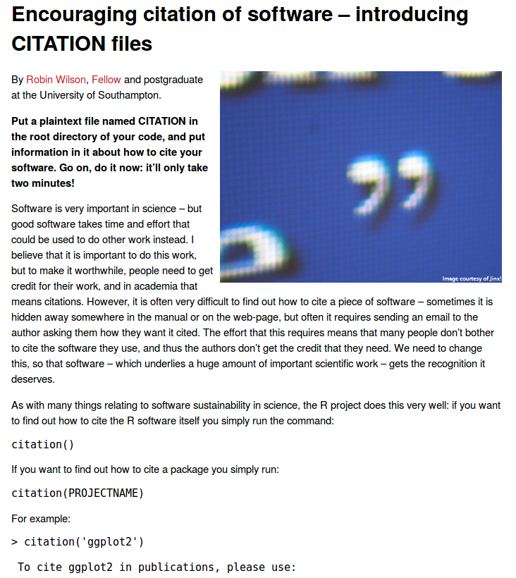
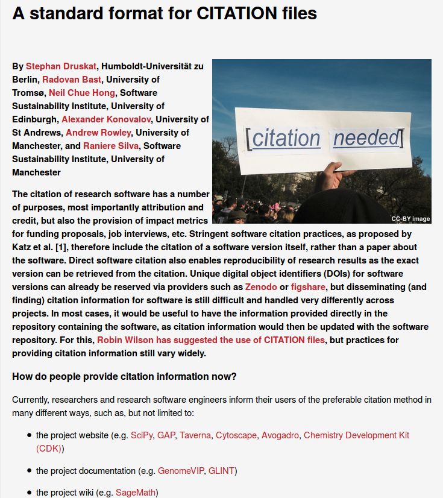
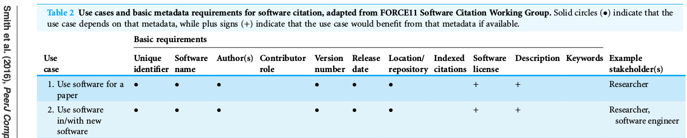

## Making research software easily citable<br/>with the Citation File Format

Stephan Druskat

Collaborations Workshop 2018, School of Mathematics, Cardiff University, Cardiff, Wales, 26 March 2018.

Slides: https://sdruskat.github.io/citation-file-format-cw18/  
Notes: https://bit.ly/citation-file-format-cw18

Note:
Okay, notes work! 3 blank lines = left, 2 blank lines = down.


## Who I am

Stephan Druskat, RSE (linguistics, digital humanities)  
at Humboldt-Universität zu Berlin


We're here because

## Software citation is (still) hard


## It's hard because ...

... it isn't embedded in researchers' workflows / general citation.  
... it isn't supported by central tools (BibTeX, publishers).  
... **the necessary metadata isn't easily accessible.**


## Metadata is the key

**Hypothesis:** If the necessary citation metadata for a software is provided accessibly, citation can be hacked to support software citation.


## Agenda & Aims of the session

1. Learn about the *Citation File Format* & how to provide software citation metadata with it
2. Discuss the format, its potential, its issues
3. Learn about other efforts & discuss solutions for aligning CFF with them, in order to embed CFF in the wider software citation context


## Introductions

Notes: https://bit.ly/citation-file-format-cw18

Please add:
- Your name
- Where you're from
- One thing you want to learn in this session, *or*  
one thing that you missed in the session, one question you'd like answered ...


## (Very brief)<br/>software citation metadata history

(for generic software citation)


## CITATION files

- Wilson, Robin: "Encouraging citation of software – introducing CITATION files". SSI blog. http://bit.ly/SSI-blog-citation-files.

Plain-text file called `CITATION` in repository root, includes, e.g., a BibTeX snippet and instructions for citing researchers.


<!-- .element height="50%" width="50%" -->


## CodeMeta

- Jones, Matthew B. et al. 2017. "CodeMeta: an exchange schema for software metadata. Version 2.0". KNB Data Repository. [doi:10.5063/schema/codemeta-2.0](https://doi.org/10.5063/schema/codemeta-2.0) ([Website](https://codemeta.github.io))

"Rosetta stone" for software metadata formats via crosswalk table, also JSON-LD representation. "Let resources talk to each other."

```
{
  "@context": "https://doi.org/10.5063/schema/codemeta-2.0",
  "@type": "SoftwareSourceCode",
  "identifier": "CodeMeta",
  "description": "CodeMeta is a concept vocabulary that can be used to standardize the exchange of software metadata across repositories and organizations.",
  "name": "CodeMeta: Minimal metadata schemas for science software and code, in JSON-LD",
  "codeRepository": "https://github.com/codemeta/codemeta",
  "issueTracker": "https://github.com/codemeta/codemeta/issues",
  "license": "https://spdx.org/licenses/Apache-2.0",
  "version": "2.0",
  "author": [
    {
      "@type": "Person",
      "givenName": "Carl",
      "familyName": "Boettiger",
      "email": "cboettig@gmail.com",
      "@id": "http://orcid.org/0000-0002-1642-628X"
    },
    {
      "@type": "Person",
      "givenName": "Matthew B.",
      "familyName": "Jones",
      "email": "jones@nceas.ucsb.edu",
      "@id": "http://orcid.org/0000-0003-0077-4738"
    }
  ],
  "contributor": [
    {
      "@type": "Person",
      "givenName": "Abby Cabunoc",
      "familyName": "Mayes",
      "email": "abbycabs@gmail.com"
    },
    {
      "@type": "Person",
      "givenName": "Arfon",
      "familyName": "Smith",
      "email": "arfon.smith@gmail.com",
      "@id": "http://orcid.org/0000-0002-3957-2474"
    },
    {
      "@type": "Person",
      "givenName": "Peter",
      "familyName": "Slaughter",
      "email": "slaughter@nceas.ucsb.edu",
      "@id": "http://orcid.org/0000-0002-2192-403X"
    },
    {
      "@type": "Person",
      "givenName": "Kyle",
      "familyName": "Niemeyer",
      "email": "Kyle.Niemeyer@oregonstate.edu",
      "@id": "http://orcid.org/0000-0003-4425-7097"
    },
    {
      "@type": "Person",
      "givenName": "Yolanda",
      "familyName": "Gil",
      "email": "GIL@ISI.EDU",
      "@id": "http://orcid.org/0000-0001-8465-8341"
    },
    {
      "@type": "Person",
      "givenName": "Krzysztof",
      "familyName": "Nowak"
    },
    {
      "@type": "Person",
      "givenName": "Martin",
      "familyName": "Fenner",
      "@id": "http://orcid.org/0000-0003-1419-2405"
    },
    {
      "@type": "Person",
      "givenName": "Mark",
      "familyName": "Hahnel",
      "@id": "http://orcid.org/0000-0003-4741-0309"
    },
    {
      "@type": "Person",
      "givenName": "Luke",
      "familyName": "Coy",
      "email": "luke.coy@rit.edu"
    },
    {
      "@type": "Person",
      "givenName": "Alice",
      "familyName": "Allen",
      "email": "aallen@ascl.net",
      "@id": "http://orcid.org/0000-0003-3477-2845"
    },
    {
      "@type": "Person",
      "givenName": "Mercè",
      "familyName": "Crosas",
      "@id": "http://orcid.org/0000-0003-1304-1939"
    },
    {
      "@type": "Person",
      "givenName": "Ashley",
      "familyName": "Sands",
      "@id": "http://orcid.org/0000-0001-5636-0433"
    },
    {
      "@type": "Person",
      "givenName": "Neil",
      "familyName": "Chue Hong",
      "email": "n.chuehong@epcc.ed.ac.uk",
      "@id": "http://orcid.org/0000-0002-8876-7606"
    },
    {
      "@type": "Person",
      "givenName": "Patricia",
      "familyName": "Cruse",
      "@id": "http://orcid.org/0000-0002-9300-5278"
    },
    {
      "@type": "Person",
      "givenName": "Dan",
      "familyName": "Katz",
      "email": "dskatz@illinois.edu",
      "@id": "http://orcid.org/0000-0003-2720-0339"
    },
    {
      "@type": "Person",
      "givenName": "Carole",
      "familyName": "Goble",
      "email": "carole.goble@manchester.ac.uk",
      "@id": "http://orcid.org/0000-0003-1219-2137"
    },
    {
      "@type": "Person",
      "givenName": "Carl",
      "familyName": "Boettiger",
      "email": "cboettig@gmail.com",
      "@id": "http://orcid.org/0000-0002-1642-628X"
    },
    {
      "@type": "Person",
      "givenName": "Stephan",
      "familyName": "Druskat",
      "email": "mail@sdruskat.net",
      "@id": "http://orcid.org/0000-0003-4925-7248"
    }
  ],
  "maintainer": {
    "@type": "Person",
    "givenName": "Carl",
    "familyName": "Boettiger",
    "email": "cboettig@gmail.com",
    "@id": "http://orcid.org/0000-0002-1642-628X"
  },
  "contIntegration": "https://travis-ci.org/codemeta/codemeta",
  "developmentStatus": "active",
  "downloadUrl": "https://github.com/codemeta/codemeta/archive/2.0.zip",
  "funding":"National Science Foundation Award #1549758; Codemeta: A Rosetta Stone for Metadata in Scientific Software",
  "keywords": [
    "metadata",
    "software"
  ],
  "softwareVersion":"2.0",
  "dateCreated":"2017-06-05",
  "datePublished":"2017-06-05",
  "programmingLanguage": "JSON-LD"
}
```


## Citation File Format (CFF)

WSSSPE5.1: Standardize `CITATION` files: machine-readability, keep it human-writable, adopt Software Citation Principles.

- Druskat S, Bast R, Chue Hong N, Konovalov A, Rowley A, Silva R. 2017. "A standard format for CITATION files". SSI blog. [[online](http://bit.ly/ssi-citation-file-format)]
- Smith AM, Katz DS, Niemeyer KE, FORCE11 Software Citation Working Group. 2016. "Software citation principles". PeerJ Computer Science 2:e86. [[online](https://doi.org/10.7717/peerj-cs.86)] 


<!-- .element height="50%" width="50%" -->


## CFF - Features

- YAML 1.2
- Explicit focus on "simple" citation use cases
- Enforces software citation principles
- Compatibility with CodeMeta



Source: https://doi.org/10.7717/peerj.2394/table-2


## CFF - Structure

- `CITATION.cff`
- Simple key-value map  
<pre><code class="yaml">cff-version: {string}
message: {string}
authors: {list of person/entity object(s)}
date-released: {date}
title: {string}
version: {string}</code></pre>
- Referenced software version at root
- Secondary references definable
- Three simple object types:
    - *entity* (min. `name`)
    - *person* (min. `family-names`, `given-names`)
    - *reference* (min. `type`, `authors`, `title`)


## CFF - Simple example

```
cff-version: 1.0.3
message: If you use this software, please cite it as below.
authors:
  - family-names: Druskat
    given-names: Stephan
    orcid: https://orcid.org/0000-0003-4925-7248
title: My Research Tool
version: 1.0.4
doi: 10.5281/zenodo.1234
date-released: 2017-12-18
```


## CFF - slightly extended example

<pre><code class="yaml" style="max-height: 600px;">cff-version: 1.0.3
message: If you use this software, please cite it as below.
authors:
  - family-names: Druskat
    given-names: Stephan
    orcid: https://orcid.org/0000-0003-4925-7248
    affiliation: "Humboldt-Universität zu Berlin, Dept. of German Studies and Linguistics"
    email: mail@sdruskat.net
    website: https://hu.berlin/sdruskat
title: My Research Tool
version: 1.0.4
doi: 10.5281/zenodo.1234
date-released: 2017-12-18
repository-code: https://github.com/sdruskat/my-research-tool
repository-artifact: https://hu.berlin/nexus/mrt
license: Apache-2.0
url: https://sdruskat.github.io/my-research-tool
keywords:
  - "McAuthor's algorithm"
  - linguistics
  - nlp
  - parser
  - deep convolutional neural network</code></pre>


## CFF - Secondary reference

```
cff-version: 1.0.3
message: If you use MRT, please cite the software AND the outline paper.
    ...
references:
  - type: article
    scope: Cite this paper to reference the general concepts of MRT.
    authors:
      - family-names: Doe
        given-names: Jane
    title: "My Research Tool: A 100% accuracy syntax parser for all languages"
    year: 2099
    journal: Journal of Hard Science Fiction
    volume: 42
    issue: "13"
    doi: 10.9999/hardscifi-lang.42132
```


## CFF - Tooling

Collected in the *citation-file-format* GitHub organization:  
https://github.com/citation-file-format/citation-file-format

- [`doi2cff`](https://github.com/citation-file-format/doi2cff): Create `CITATION.cff` from a DOI (Zenodo)
- [`ruby-cff`](https://github.com/citation-file-format/ruby-cff): Manipulate `CITATION.cff` files in Ruby
- [`cff-converter-python`](https://github.com/citation-file-format/cff-converter-python): Read CFF files and converting them to, e.g., BibTeX
- [`cff-reader-java`](https://github.com/citation-file-format/cff-reader-java): Read `CITATION.cff` files into a POJO model
- [`schema`](https://github.com/citation-file-format/schema): Validate `CITATION.cff` files against schemas


## CFF - Uptake

- 50 `CITATION.cff` files on GitHub today
- [Netherlands eScience Center](https://www.esciencecenter.nl/) has adopted CFF (and tooling)
- [CiteAs.org](http://citeas.org/) is implementing CFF support


## Hands-on pair activity

1. Break into pairs 
2. Create a `CITATION.cff` file together, for a (fictional) software of your choice

Options for getting started:
- Copy'n'paste example from the end of the Notes doc:  
https://bit.ly/citation-file-format-cw18
- Use `doi2cff` for a software that's on Zenodo (requires Python 3):  
http://bit.ly/doi2cff
- Browse the specs and pick an example:  
http://bit.ly/cff-specs-v1
- The key-complete test file for the CFF schema:  
http://bit.ly/cff-schema-v1

Note:
Aim at providing as much metadata as possible, use the specs.


## Cheat sheet

```
cff-version: 1.0.3
message: If you use this software, please cite it as below.
authors:
  - family-names: Druskat
    given-names: Stephan
    orcid: https://orcid.org/0000-0003-4925-7248
title: My Research Tool
version: 1.0.4
doi: 10.5281/zenodo.1234
date-released: 2017-12-18
```

- Copy'n'paste example from the end of the Notes doc:  
https://bit.ly/citation-file-format-cw18
- Use doi2cff for a software that's on Zenodo (requires Python 3):  
http://bit.ly/doi2cff
- Browse the specs and pick an example:  
http://bit.ly/cff-specs-v1
- The key-complete test file for the CFF schema:  
http://bit.ly/cff-schema-v1


## Can software be made citable easily with CFF?

### Group discussion

* How easy was it to provide citation metadata for your exemplary software?
* How accessible have you found the documentation?
* What could have helped you making the provision process easier?
* Have you found omissions in the format specifications, e.g., metadata that hasn't been addressed?
* What do you think can/should be done with the provided metadata?

*To be continued during hack day?*


## Excursion: CFF & CodeMeta


Source: https://xkcd.com/927/


## CodeMeta

- Project: rosetta stone for software metadata
- Format: `codemeta.json`
	- extends [schema.org](https://schema.org/), i.e., linked data
- Support: [CiteAs.org](http://citeas.org/), [CalTechDATA](https://www.library.caltech.edu/news/enhanced-software-preservation-now-available-caltechdata), Zenodo (tbc)


## CodeMeta: Example file

<pre><code class="json" style="max-height: 600px;">{"@context": "https://doi.org/10.5063/schema/codemeta-2.0",
    "@type": "SoftwareSourceCode",
    "codeRepository": "https://github.com/NLeSC/boatswain",
    "datePublished": "2018-01-16",
    "author": [{
        "@type": "Person",
        "givenName": "Berend",
        "familyName": "Weel",
        "affiliation": {
            "@type": "Organization",
            "legalName": "Netherlands eScience Center"
        }
    }, {
        "@type": "Person",
        "additionalName": "H.",
        "givenName": "Jurriaan",
        "familyName": "Spaaks",
        "affiliation": {
            "@type": "Organization",
            "legalName": "Netherlands eScience Center"
        }
    }],
    "keywords": ["docker", "docker-compose", "containers"],
    "license": "http://www.apache.org/licenses/LICENSE-2.0",
    "version": "1.0.2",
    "identifier": "https://doi.org/10.5281/zenodo.1149011",
    "name": "boatswain"}
</code></pre>


## CFF & CodeMeta: Differences (?)

|CFF|CodeMeta|
|--|--|
|human-centric|machine-centric|
|enforces best practices|?|
|specificity*|genericity|
|reference scope|?|

\* E.g., `version` + `commit`/`softwareVersion`


## Reconcile CFF & CodeMeta

1. **Let CFF die**
    - Community? Tools? Effort?
2. Transform CFF into **CodeMeta YAML representation**
    - Align keys (JSON = true YAML subset)
    - Linked data in YAML? Principles enforcement? Specificity?
3. Achieve and keep **full compatibility**
    - Drain resources? Competition in such a small community?
    - Tooling?

*To be continued during hack day?*


## What have we learned?


## Thanks!

And perhaps see you in a hack day activity  
around the Citation File Format?

(Or the [cite.research-software.org](https://cite.research-software.org) portal?)